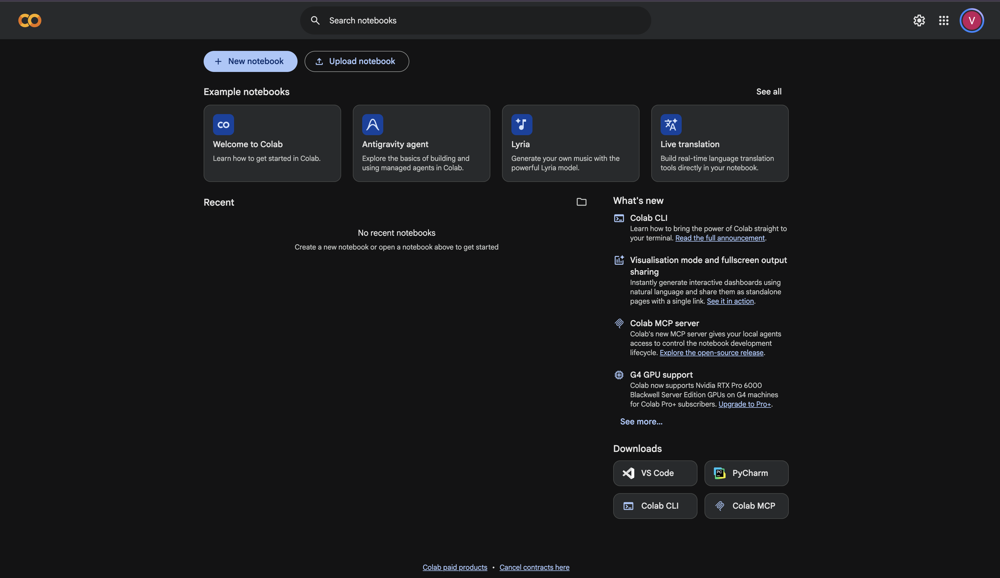
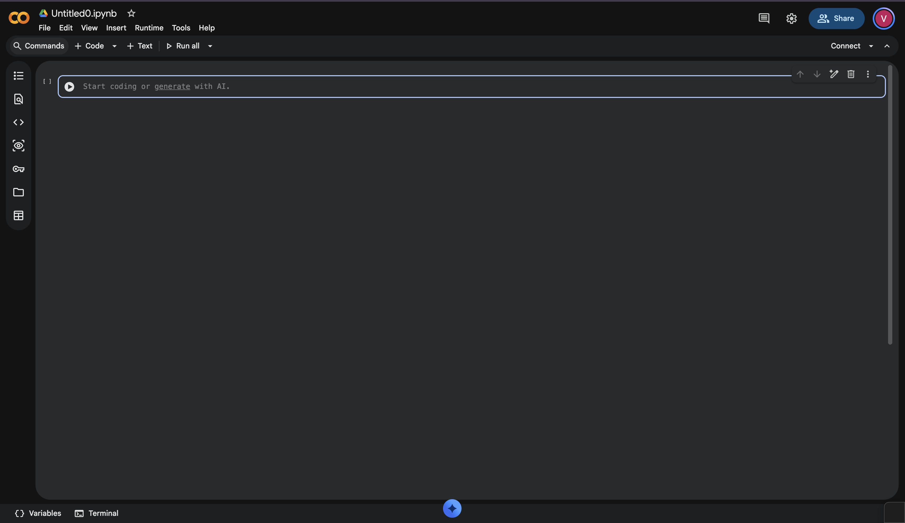
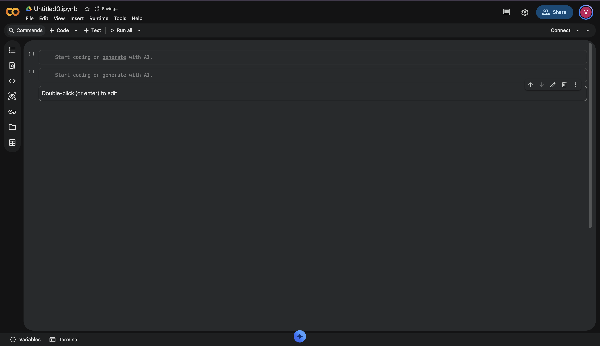
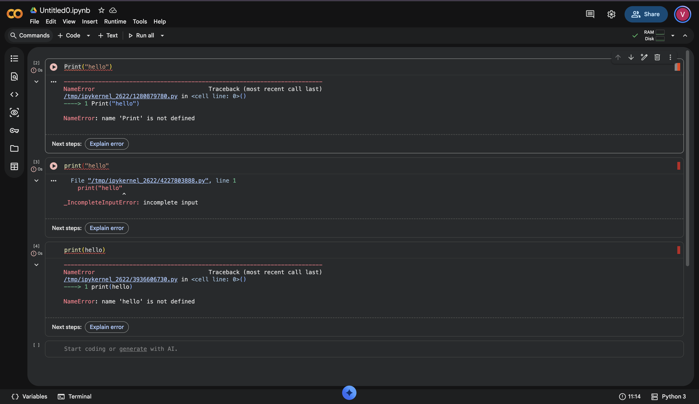
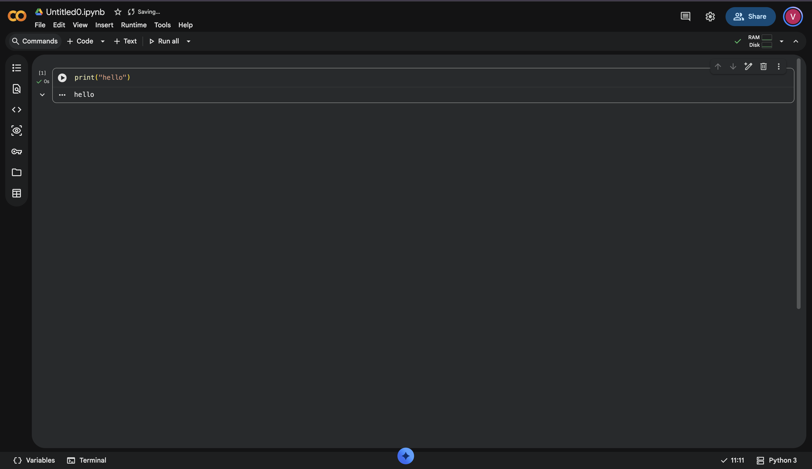
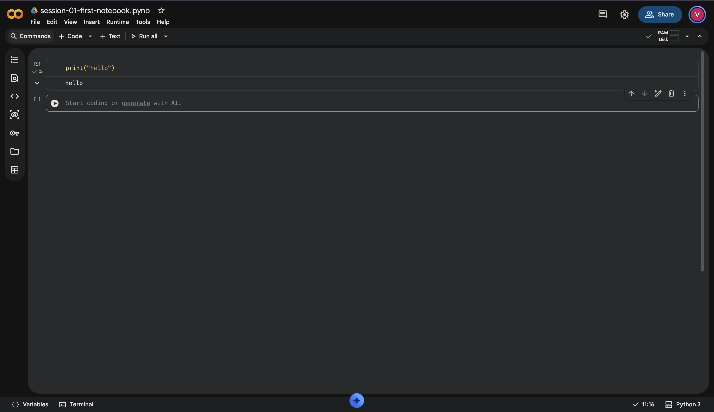
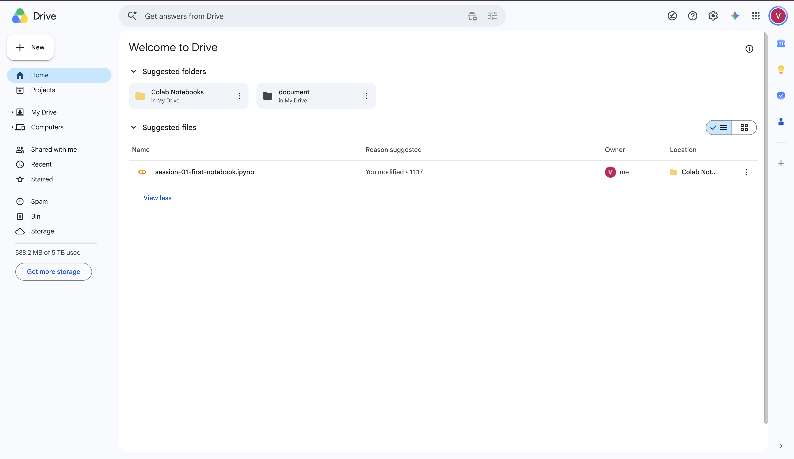
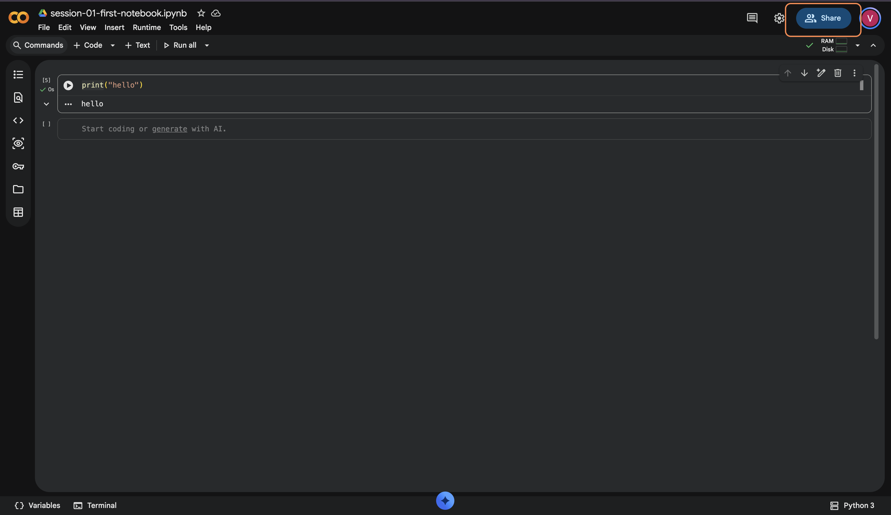
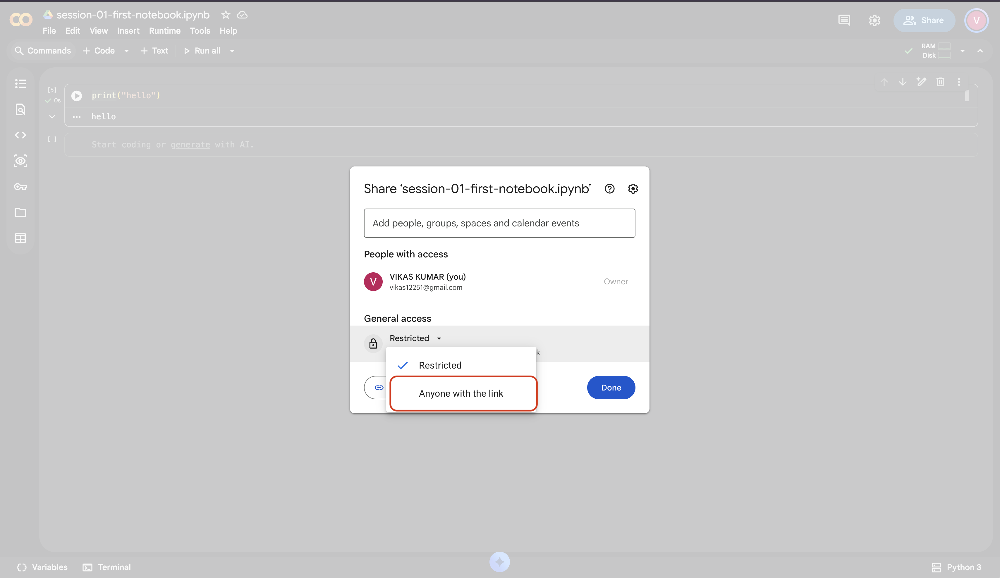

# Getting Into Colab

Colab is a website where you write and run code. Nothing to install — it runs in your browser, and the computing happens on Google's machines, so any laptop will do.

**You need:** Chrome, an internet connection, and your Google account password.

---

## Part A — Open Colab

### Step 1 — Go to Colab

Open Chrome, type this into the address bar, and press Enter:

```
colab.research.google.com
```

**You should see:** a blue and white page that says "Welcome to Colab".



### Step 2 — Sign in

If Colab asks you to sign in, use your Google account. If it takes you straight in, go to Step 3.

Check which account you are in by clicking the profile picture in the top right. Your work saves to that account, and looking in the wrong one is the usual reason people think they have lost a notebook.

### Step 3 — Create a new notebook

A box opens showing a list of files. The first time, this list is empty.

Click **New notebook** in the bottom-right corner of that box. If the box did not open, use the menu at the top: **File → New notebook**.

**You should see:** a new empty page, with `Untitled0.ipynb` at the top left.



---

## Part B — What a Notebook Is

A notebook is a page made of boxes. Each box is called a **cell**.

| Cell type | What goes inside it | How to recognise it |
|---|---|---|
| **Code cell** | Instructions for the computer to carry out | Has a play button on its left |
| **Text cell** | Writing for humans to read | No play button |

Your new notebook contains one empty code cell. That is what you will use.

To add more cells later, click **+ Code** or **+ Text** in the toolbar at the top.



---

## Part C — Run Your First Code

### Step 4 — Type into the cell

Click inside the empty code cell and type exactly this:

```python
print("hello")
```

- `print` is all lowercase. `Print` will not work.
- Do not leave out the brackets `(` `)` or the quote marks `"` `"`.
- Type it rather than pasting it.



### Step 5 — Run it

Click the play button on the left of the cell, or press **Shift + Enter**.

### Step 6 — Look at the output

The first run of a session takes a few seconds. Then this appears below the cell:

```
hello
```

**You should see:** the word `hello` below the cell, and a green tick where the play button was.



---

## Part D — Save It, and Find It Again

### Step 7 — Rename the notebook

At the top left it says `Untitled0.ipynb`. Click on that text and change it to something you will recognise:

```
session-01-first-notebook
```

**You should see:** your new name at the top of the page.



### Step 8 — Save it

Press **Ctrl + S** (on a Mac, **Cmd + S**), or use **File → Save**.

**You should see:** "Saving..." appear briefly, then "Saved".

### Step 9 — Close the tab

Close the browser tab completely.

### Step 10 — Find it again

Open a new tab and go to:

```
drive.google.com
```

On the left there is a folder called **Colab Notebooks**. Open it. Your notebook is inside.

Double-click it. It opens exactly as you left it, with the `hello` output still there.

**You should see:** the same notebook, unchanged.



---

## Part E — Share the Link

### Step 11 — Click Share

The **Share** button is in the top-right corner of the notebook. Click it.



### Step 12 — Change who can open it

In the box that opens, look near the bottom for **General access**. It will probably say **Restricted**.

Click it and change it to **Anyone with the link**.

If you skip this step, nobody will be able to open your notebook. They will see a message saying "You need access".



### Step 13 — Copy the link

Click **Copy link**, then **Done**. Paste it wherever you are submitting your work.
