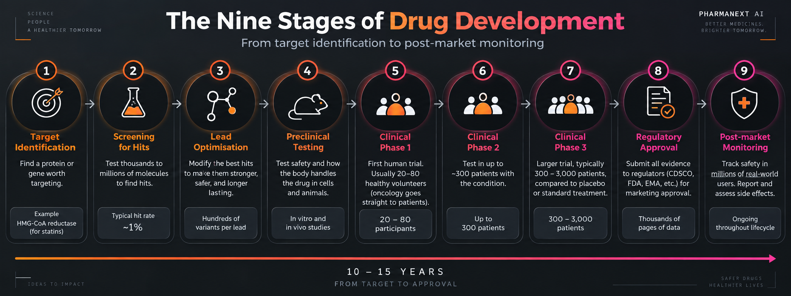

# How Medicines Are Made

Every medicine on a pharmacy shelf went through the same nine stages, and took between ten and fifteen years to do it.

---

## The Nine Stages

### 1. Finding a target

A **target** is a protein in the body that a drug can act on to change something.

Cholesterol is made in the liver by an enzyme called HMG-CoA reductase. Block that enzyme and the body makes less cholesterol. That enzyme is the target, and statins are the drugs that block it.

**The question at this stage:** is this protein worth attacking, and would blocking it actually help the patient?

### 2. Screening for hits

Thousands to millions of molecules are tested against the target to see whether any of them affect it.

A molecule that shows any measurable effect is called a **hit**. A hit rate of around one per cent is normal, so a screen of 100,000 molecules might produce a thousand hits, of which only a handful survive the next stage.

**The question:** does any molecule we have do anything to this target?

### 3. Lead optimisation

The best hits are called **leads**. Chemists then make modified versions of a lead and test each one, looking for a version that is stronger, safer, or stays in the body longer.

A single lead can go through hundreds of variants before one is good enough to take forward.

**The question:** can we improve this molecule enough to make it a real candidate?

### 4. Preclinical testing

Safety testing before any human is involved. First on cells in a dish, then on animals.

This is where the body's handling of the drug is measured for the first time: how much is absorbed, where it goes, how the liver breaks it down, how quickly it leaves, and whether it damages anything.

**The question:** is this safe enough to give to a person?

### 5. Clinical Phase 1

The first human trial. Usually 20 to 80 people, normally healthy volunteers, given the drug at carefully increasing doses.

Cancer drugs are the exception: they go straight to patients, because giving a cytotoxic drug to a healthy volunteer is not acceptable.

**The question:** is it safe in humans, and how much can we give?

### 6. Clinical Phase 2

Up to about 300 patients who actually have the condition, given the drug at the doses Phase 1 established as safe.

**The question:** does it treat the disease?

### 7. Clinical Phase 3

Typically 300 to 3,000 patients, compared against either a placebo or the existing standard treatment.

This is the most expensive stage, and it is where most late failures happen.

**The question:** is it better than what patients already have?

### 8. Regulatory approval

All the evidence is compiled into a submission that can run to thousands of pages and sent to the regulator: CDSCO in India, the FDA in the United States, the EMA in Europe.

**The question:** does the evidence justify letting this be sold?

### 9. Post-market monitoring

Approval is not the end. A trial involves a few thousand people; the market involves millions. Side effects that occur in one person in fifty thousand only become visible after launch.

Every report of a problem is collected and assessed. If it meets the definition of serious — death, a life-threatening event, hospitalisation, permanent disability or a birth defect — it must reach the regulator within 15 days.

**The question:** is it still safe now that millions of people are taking it?

---

## Who Does What

| Department | Stages | What they do |
|---|---|---|
| **Discovery** | 1 to 3 | Find targets, screen molecules, improve the promising ones |
| **Preclinical** | 4 | Safety and body-handling testing before humans |
| **Clinical Research** | 5 to 7 | Design and run human trials |
| **Clinical Data Management** | 5 to 7 | Clean, check and prepare the data those trials produce |
| **Regulatory Affairs** | 8 | Compile the evidence and obtain permission to sell |
| **Manufacturing and QC** | After approval | Produce the drug, and test every batch against specification |
| **Quality Assurance** | All stages | Ensure the required procedures are being followed and are documented |
| **Pharmacovigilance** | 9 | Collect and assess reports of harm after launch |

In India, the largest number of pharmacy graduates are employed in pharmacovigilance, clinical data management and regulatory affairs — stages 5 to 9, not stages 1 to 3.

---

## Why So Few Make It

| Measure | Figure |
|---|---|
| Time from target to approval | 10 to 15 years |
| Average cost per approved drug | Around $2.6 billion, including the cost of failures |
| Candidates entering clinical trials that never reach approval | About 9 in 10 |

The cost figure is not what one successful drug costs. It includes every failed programme that came before it, because those failures are paid for by the drugs that succeed.

### What the failures are caused by

Published reviews of clinical-stage failures give roughly this breakdown. The exact figures vary by disease area.

| Cause | Approximate share |
|---|---|
| The drug does not work well enough | 40 to 50 per cent |
| Safety and toxicity problems | About 30 per cent |
| The body absorbs, distributes or removes it badly | 10 to 15 per cent |
| Commercial or strategic reasons | About 10 per cent |

The second and third rows together come to around **40 per cent of all failures — problems with how the body handles the molecule, or the harm it causes.** Both are properties a computer can now estimate before the molecule is ever synthesised.

A failure found at stage 2 costs a few weeks of laboratory time. The same failure found at stage 7 costs years and a large part of that $2.6 billion.
