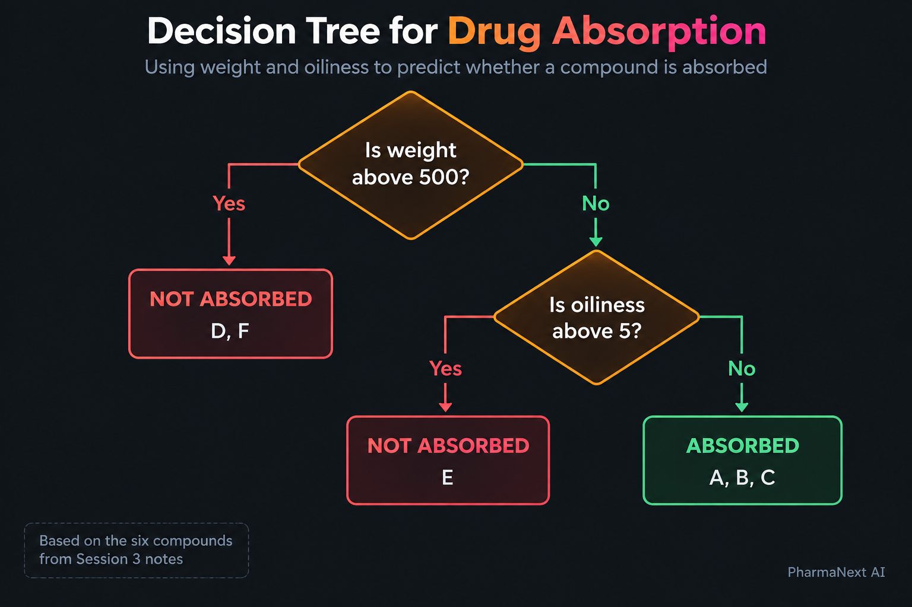
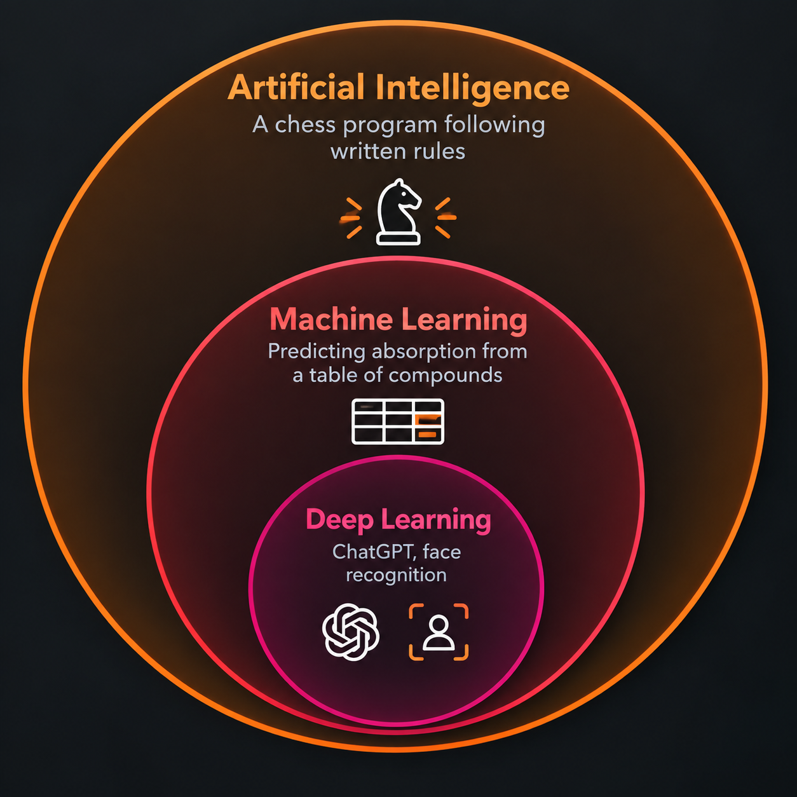

# What AI Actually Is

---

## Start With Six Compounds

Six compounds were given to volunteers as tablets. For each one, somebody measured whether it was absorbed properly into the blood.

| Compound | Weight | Absorbed well? |
|---|---|---|
| A | 210 | Yes |
| B | 305 | Yes |
| C | 480 | Yes |
| D | 620 | No |
| E | 710 | No |
| F | 850 | No |

Look at the table for a moment before reading on. **What is the rule?**

You will have found it. Light compounds are absorbed. Heavy ones are not. The change happens somewhere between 480 and 620.

Now a seventh compound arrives. It weighs 350. Nobody has tested it.

**You can already predict the answer.** Not because anyone told you the rule, but because you worked it out by looking at six examples.

That is machine learning. The only difference is the number of examples and who does the looking.

---

## Now Make It Harder

Here is the same kind of table, with one more thing measured.

**Oiliness** is a number describing whether a molecule dissolves better in oil or in water. It matters because a drug has to do two opposite things: first dissolve in the watery contents of the stomach, then pass through the wall of a cell — and cell walls are made of fat. A molecule that is too watery never gets through the wall. One that is too oily never dissolves in the first place.

A low number means watery. A high number means oily.

| Compound | Weight | Oiliness | Absorbed well? |
|---|---|---|---|
| A | 210 | 1.2 | Yes |
| B | 305 | 2.8 | Yes |
| C | 480 | 4.1 | Yes |
| D | 620 | 2.0 | No |
| E | 410 | 7.5 | **No** |
| F | 850 | 3.1 | No |

Look at compound **E**. It weighs 410, which is light. By the rule you found earlier it should have been absorbed. It was not.

The reason is in the second column. Its oiliness is 7.5, far higher than any of the others. Too oily to dissolve.

So the real rule is not "light compounds are absorbed". It is closer to: *light compounds are absorbed, unless they are very oily.* Two things interacting, and the second one only matters sometimes.

With six rows you can still see it. With five thousand rows and twenty columns, no person can. **That is the point at which you hand the job to a computer.**

---

## The Words For What You Just Saw

Every one of these words appears in every later module. They all describe the table above.

The whole table is a **dataset**.

Each **row** is one thing that was measured. Here, one compound.

Each **column** is one property of that thing.

The columns the computer is allowed to look at are the **features**. Here: weight and oiliness.

The column you want it to work out is the **label**. Here: absorbed well, yes or no.

So: *the computer learns the relationship between the features and the label.* You now know exactly what that sentence means, because you just did it yourself with six rows.

---

## What a Model Is

When you looked at that table and worked out the rule, the rule ended up in your head. When a computer does it, the rule ends up in a **model**.

**A model is the rule the computer worked out.**

It is not a program someone wrote. It is not something that thinks. It is a set of numbers that, given a new compound's weight and oiliness, produce an answer.

### How the numbers get there

Before it sees any data, a model's numbers are random. Ask it about compound A and it answers nonsense.

Then **training** begins:

1. Show it compound A. It guesses.
2. Compare its guess to the real answer in the label column.
3. If the guess was wrong, change the numbers slightly so that the same guess would come out closer to correct next time.
4. Move to compound B. Repeat.

Go through all six compounds. Then go through them again. And again — often thousands of times.

Each pass makes the numbers slightly better. Eventually they stop changing much, because the model is getting most rows right. That is the end of training.

Nobody chose those numbers. They came out of the data.

### Using it afterwards

A trained model is a file. You save it, send it to a colleague, open it a year later.

Give it the seventh compound — weight 350, oiliness 2.1 — and it gives you an answer. That answer is a **prediction**.

---

## Written Rules and Learned Rules

There are two ways to end up with a rule, and the difference matters.

### Somebody works it out and writes it down

> A molecule weighing more than 500 will probably not be absorbed when swallowed.

That is a real rule. In 1997 Christopher Lipinski looked at drugs that already worked as tablets, noticed what they had in common, and wrote it down.

A computer using that rule is following an instruction someone typed. It has learned nothing. If the rule is wrong for a particular family of compounds, it will be wrong every single time and never notice.

### The computer works it out from examples

Give it five thousand rows like the table above and say nothing about weight, oiliness or Lipinski.

It will probably rediscover that weight matters. It may also find the thing you spotted about compound E — that oiliness overrides weight above a certain point — and it will find it without anyone suggesting to look.

### What you gain and what you lose

| | Written rule | Learned rule |
|---|---|---|
| Where it came from | A person noticing a pattern | The computer, from data |
| What you need | Someone who understands the problem | Enough measured examples |
| Can you read it? | Yes. It is one sentence. | Often not. |
| Finds patterns nobody noticed | No | Yes |

The loss is real. A model can be accurate and still be unable to tell you why it answered as it did. In an industry where a decision may have to be explained to an inspector, that matters — which is why a simpler, readable model is often preferred even when a complicated one scores slightly better.

---

## Three Types of Machine Learning

Which type you are doing is decided by one question: **do you already have the answers?**

### Supervised learning

You have examples and you know the right answer for each one.

The table above is exactly this. Six compounds, and for every one of them somebody had already measured whether it was absorbed. The label column was filled in before the computer saw it.

The name comes from that: someone supervised the learning by supplying the answers.

**What you need:** rows with the label already filled in.

Roughly nine tenths of this course is supervised learning.

### Unsupervised learning

You have examples but no answers.

Imagine the same table with the last column deleted. You have ten thousand compounds and nobody has tested any of them. You ask the computer to sort them into groups of similar compounds, just to see what you have.

Nobody tells it what the groups should be, and there is no answer key to check against afterwards.

**What you need:** rows, with no label column.

### Reinforcement learning

The computer tries something, is given a score, and tries again.

A program builds a molecule one piece at a time. When it finishes, the molecule is scored. A good score means do more of that; a poor score means do less. Repeat a few million times.

**What you need:** a way to score an attempt automatically.

This is real and is used in molecular design research, but it is not part of this course.

---

## Two Kinds of Model

Nearly everything you will build is one of two kinds. They work very differently.

### Decision trees

Go back to what you did with the six compounds. You effectively asked:

> Is the weight above 500?
> If yes, predict not absorbed.
> If no, is the oiliness above 5?
> If yes, predict not absorbed.
> Otherwise, predict absorbed.

That chain of yes-or-no questions is a **decision tree**. You built one in your head without being told the name.

The computer chooses the questions itself. At each step it tries every possible question and keeps the one that best separates the rows it has left.

One tree is easy to read but not very accurate, so two improvements are normally used:

- A **random forest** builds hundreds of trees, each on a different slice of the rows, then takes the majority answer.
- **Gradient boosting** builds trees one after another, each new tree concentrating on the rows the earlier ones got wrong.

Together these are called **tree-based methods**. They work well on tables and do not need many rows.

### Neural networks

A **neural network** works nothing like a tree.

It is built from many small units arranged in layers. Each unit takes in several numbers, multiplies each by a value of its own, adds the results together, and passes the total to the units in the next layer.

One unit on its own does almost nothing useful. Put thousands of them in enough layers and the whole structure can represent relationships far too tangled to write as a set of questions.

**Deep** learning just means a network with many layers. That is the entire meaning of the word.

Neural networks are what made face recognition, voice assistants and ChatGPT possible. In exchange they need a very large number of rows to train.

---

## Where These Three Words Fit

Now the three terms in the title can be placed properly.

**Artificial intelligence** is the outermost and the vaguest. It covers anything that makes a machine seem intelligent — a chess program from 1990, the autocomplete on your phone keyboard, YouTube choosing your next video, and ChatGPT. Because it covers so much, being told something "uses AI" tells you almost nothing.

**Machine learning** sits inside it, and is what pharmaceutical work nearly always means. It is the thing you did with the six compounds: working the rule out from examples instead of being handed it.

**Deep learning** sits inside that, and means machine learning done with neural networks.

---

## When Deep Learning Is The Wrong Choice

It is easy to assume the newest method is the best one. For the data you will meet in this course, it usually is not.

A 2022 study compared both kinds of model across 45 different datasets. Tree-based methods beat neural networks consistently on table-shaped data below about 50,000 rows, and were clearly the safer choice below 10,000.

Pharmaceutical data is almost always in that range. A set of compounds tested against one target, pulled from a public database, is typically a few hundred to a few thousand rows.

Neural networks earn their place when the data is not a table at all: images, written text, and molecular structures.

In Module 8 you will build a neural network and put it against a tree-based model on the same data. Which one wins is not decided in advance.

---

## What It Cannot Do

**It gives an answer, not a judgement.** A model can tell you that reports of liver problems for a drug are higher than expected. Whether that is a real safety problem or a coincidence is a decision a person makes.

**It cannot carry responsibility.** A regulatory submission is signed by a named human being. No model signs anything.

**It cannot check itself.** Verifying an answer needs someone who understands the subject. That is the part of the work these tools do not remove.

**It is wrong confidently.** This is the dangerous one. Give a model a compound completely unlike anything it was trained on and it will still return a number, with nothing to indicate the number is worthless. A language model will invent a reference — plausible authors, real-sounding journal, sensible year — and present it exactly as it presents a true one.
